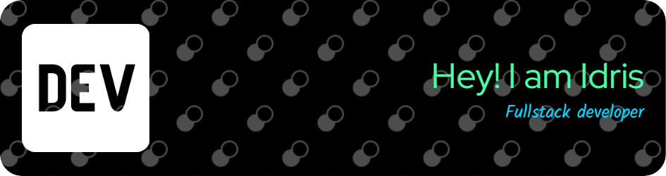

 

- 👋 Hi, I’m @chaalelidris
- 👀 I’m interested in Web Development & Web 3.0
- 🌱 I’m currently learning NodeJs,MongoDB, REST API,GraphQl, ReactJS, Machine Learning
- 💞️ I’m looking to collaborate on Web project.
- 📫 Reach me via Email : i.chaalel@esi-sba.dz | https://chaalelidris.github.io/

<!---
chaalelidris/chaalelidris is a ✨ special ✨ repository because its `README.md` (this file) appears on your GitHub profile.
You can click the Preview link to take a look at your changes.
--->
